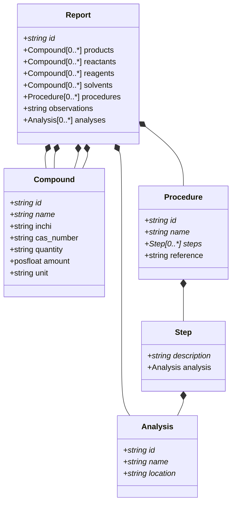

```mermaid
classDiagram
    Report *-- Compound
    Report *-- Compound
    Report *-- Compound
    Report *-- Compound
    Report *-- Procedure
    Report *-- Analysis
    Procedure *-- Step
    Step *-- Analysis
    
    class Report {
        +string id*
        +Compound[0..*] products
        +Compound[0..*] reactants
        +Compound[0..*] reagents
        +Compound[0..*] solvents
        +Procedure[0..*] procedures
        +string observations
        +Analysis[0..*] analyses
    }
    
    class Compound {
        +string id*
        +string name*
        +string inchi
        +string cas_number
        +string quantity
        +posfloat amount
        +string unit
    }
    
    class Procedure {
        +string id*
        +string name*
        +Step[0..*] steps*
        +string reference
    }
    
    class Step {
        +string description*
        +Analysis analysis
    }
    
    class Analysis {
        +string id*
        +string name*
        +string location*
    }
    
```