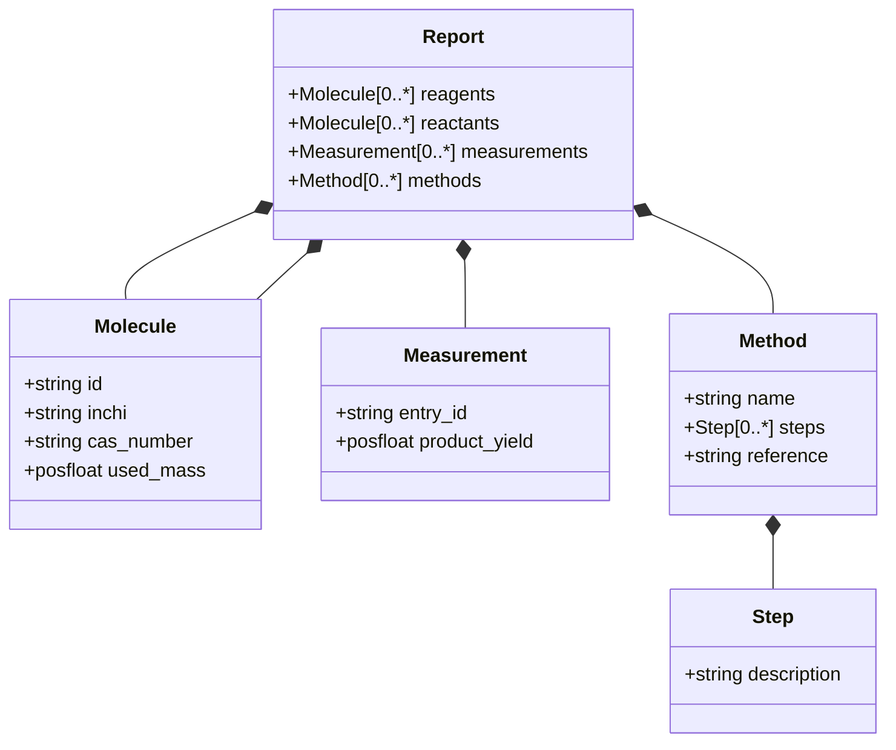

```mermaid
classDiagram
    Report *-- Molecule
    Report *-- Molecule
    Report *-- Measurement
    Report *-- Method
    Method *-- Step
    
    class Report {
        +Molecule[0..*] reagents
        +Molecule[0..*] reactants
        +Measurement[0..*] measurements
        +Method[0..*] methods
    }
    
    class Molecule {
        +string id
        +string inchi
        +string cas_number
        +posfloat used_mass
    }
    
    class Measurement {
        +string entry_id
        +posfloat product_yield
    }
    
    class Method {
        +string name
        +Step[0..*] steps
        +string reference
    }
    
    class Step {
        +string description
    }
    
```